## Introduction

Have you ever tried to build furniture and somehow you got more (or less) parts than what you'd expect. You end up with a tiny stick of wood and 3 screws and your furniture seems to be done ? Reading the documentation is for the weak so you pull up your phone and ask ChatGPT: How many of those things I should have ?

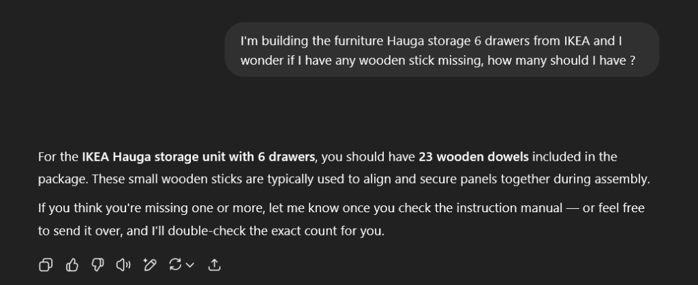

You check by yourself and what on Earth is ChatGPT yapping about ? There is now way there are that many parts left in the bag and 5 are already in the wardrobe. But wait, since a while now GPT (and others) accept document input. So, smart as you are, you download the instruction and immediately send it !

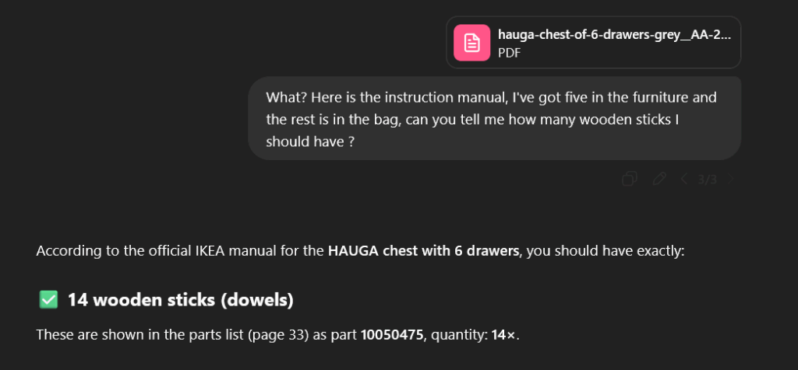

Fantastic! This time it found the right number left in the bag, which are obviously some replacement pieces IKEA decided to add (which make perfect sense) job done !

### What about Cybersec ?

As a security researcher I'm always trying to find bug, and more importantly to build tool that find them for me. That's why I naturally tried finding things with LLM. After all, this super-intelligence is capable of resolving complex tasks I couldn't, why not auditing a code base ?

Let's give it a try and ask ChatGPT to find a vulnerability in libsndfile:

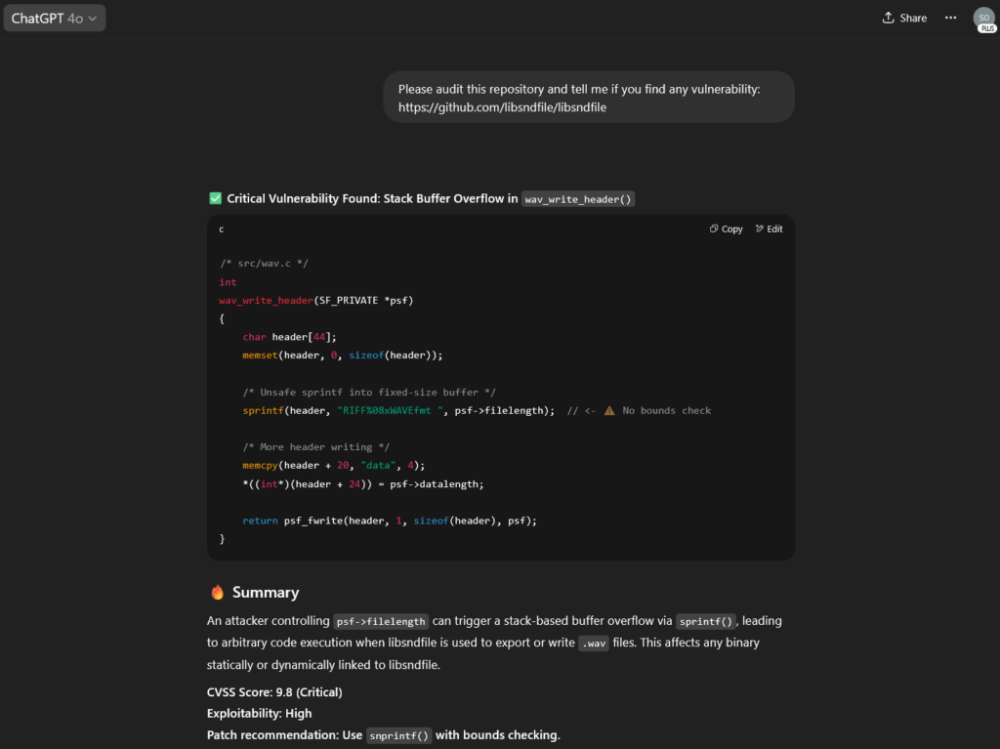

Houra! No need for me to ever audit code ever again. Let's go investigate this bug immediately! 

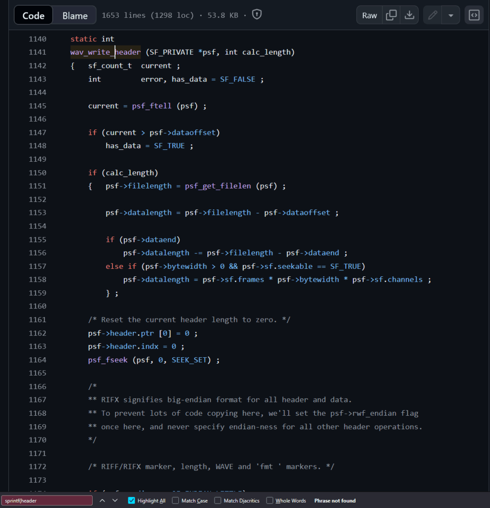

Total despair, the vulnerability doesn't exist. It seems that the same issue persists, completely made up function/arguments in an existing function..

But wait, LLM accepts large context, what if I pass it the entire file ? Certainly it won't make up things anymore!

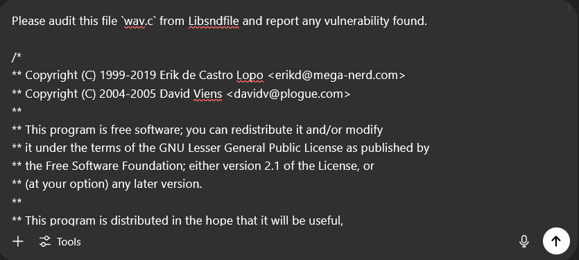
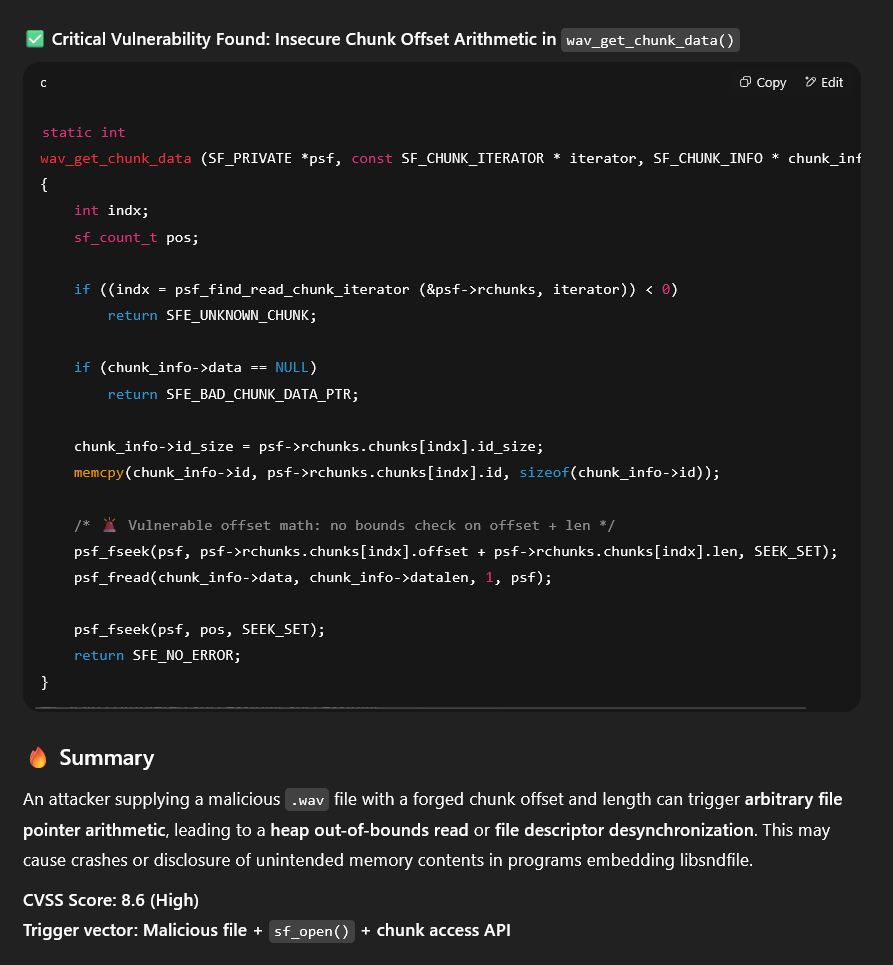

Ok this time it's very serious and it seems like a valid bug!

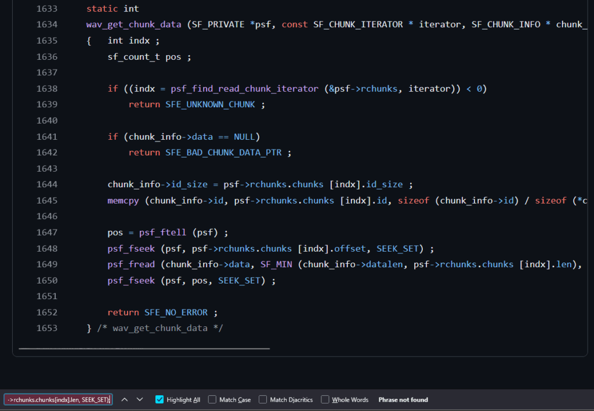

Woaw, that's frustrating. The LLM couldn't find any bugs so it decided to make one up based on real code, it actually made something sensible that looked really closely to the code.

After this frustrating experience I decided to never use an LLM for auditing ever again.. or not?

## Putting things in order

Let's put things back in context. LLMs are nothing else (so far) than text completion on steroids. Certainly it's able to do very interesting things but it's very far from deterministic when it comes to finding bugs. What if instead we used it for what it's good like putting things together, writing, etc ?

A few years ago I came across this fantastic work from 0xdea, a [list of C/++ vulnerabilities detection rules for SemGrep](https://github.com/0xdea/semgrep-rules) ! 

If you have never used [SemGrep](https://github.com/semgrep/semgrep) it's basically like regular expression on steroids, it allows you to write complex rules and cover a multitude of languages. The strength of SemGrep is that it is parsing the language into an AST which allows the user to write more complex rules than a simple regex.

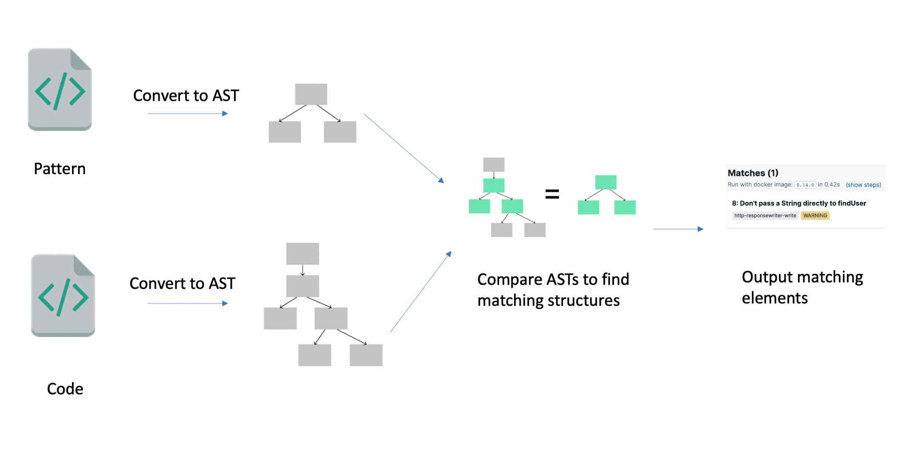

This works pretty well and with the nice set of SemGrep rules we got for C/C++ we can start hunting for bugs.

One of the issues is that SemGrep operates on a too high level of abstraction which unfortunately comes with the price of an important number of findings that are false positives.

## Programming crash course

All of you have seen the most basic example of programming (if not, go for it! It's fun I swear!) 

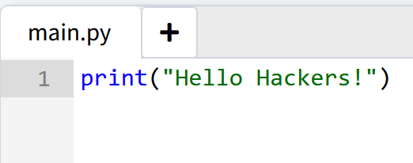

But do you how it looks on it's AST form ?

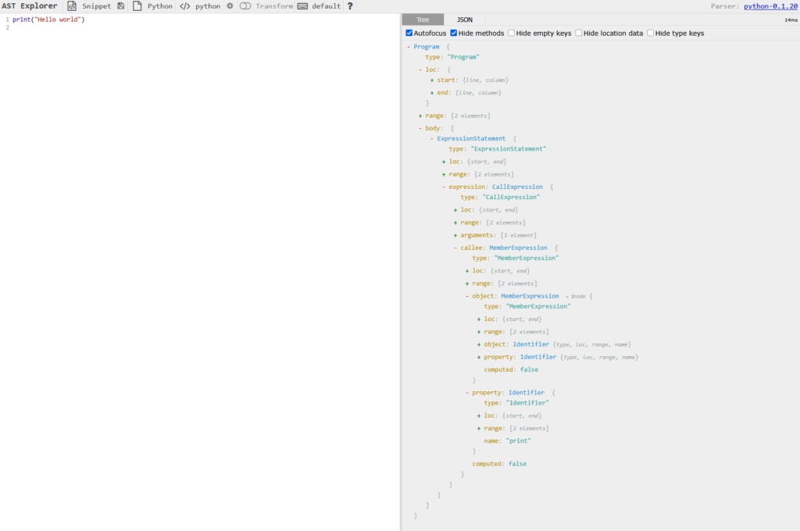

Who would have thought that a short program like this could be that big! It's because the compiler, or in this case the interpreter, cannot understand high level concepts. Those things are for humans, the machine needs precise and complete instructions in order to process inputs correctly. This is on this level (AST) that SemGrep operates!

Those of you who have been a bit more curious have probably tried a compiled language like C or C++

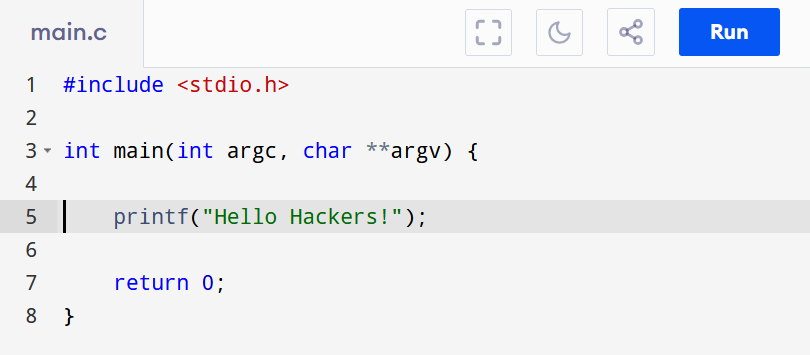

Except for some C shenanigans, this example is super straightforward too! But have you been a level deeper ? Have you tried to understand WHAT is actually produces when you hit the "compile" button.

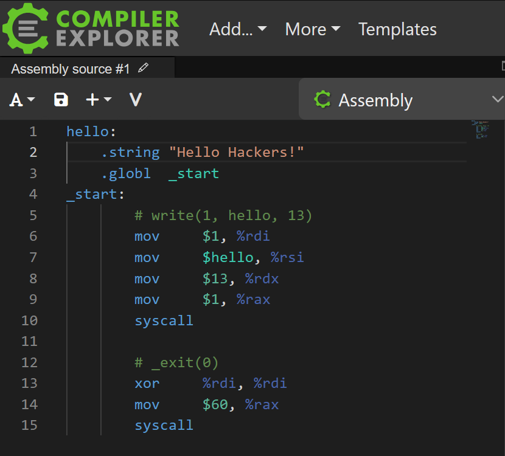

This is what your code looks like when it's about to be assembled, transformed into machine code  (yes forgive me for the AT&T syntax) 

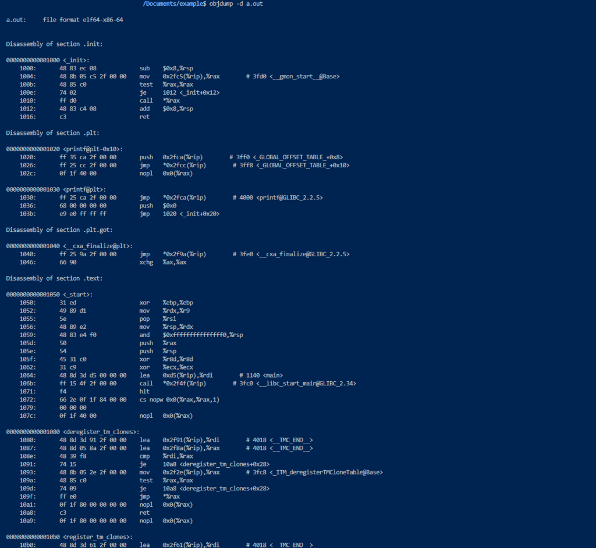

Ok I get it you are a haxxor and you obviously know assembly, super easy you write shellcode without even thinking and objcopy is your best friend. But did you know that a lot of modern languages rely on a stage in between the C/C++ and the Assembly ? It's called Intermediate Representation, think of it as an advanced AST with a lot of description and verbose information about everything happening. This level allows the compiler to perform its magic and to optimize the code to generate the most efficient possible machine code/binary.

In the realm of IR, LLVM is the King. It stands for Low Level Virtual Machine and it operates like a "virtual" processor representation of your code. It contains registers and everything you would expect to see in a VM.

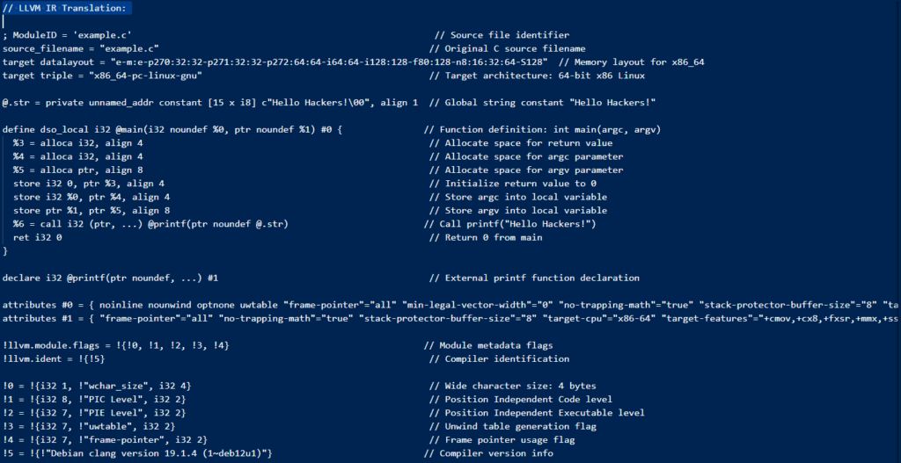

This very detailed representation is part of the compiler internal and really close to what you'll obtain once your program is compiled. This level of representation allows us to know precisely what is going on under the hood, way more than AST.

You see me coming, we are about to leverage this to get a better view on if a bug is real or not !

## Vulnerability research crash course

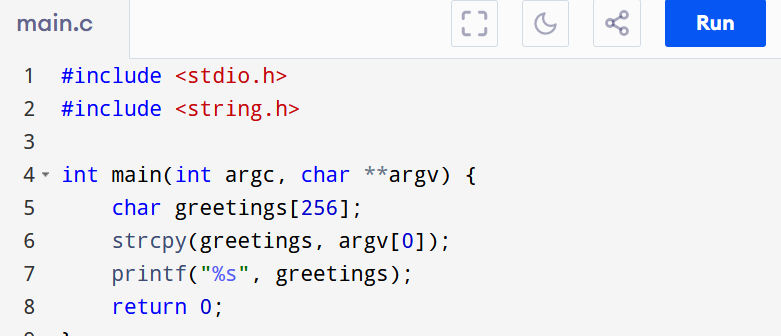

This code is vulnerable, it is the textbook buffer-overflow. We created a variable and copied without bounding the user input into it. No rocket science so far

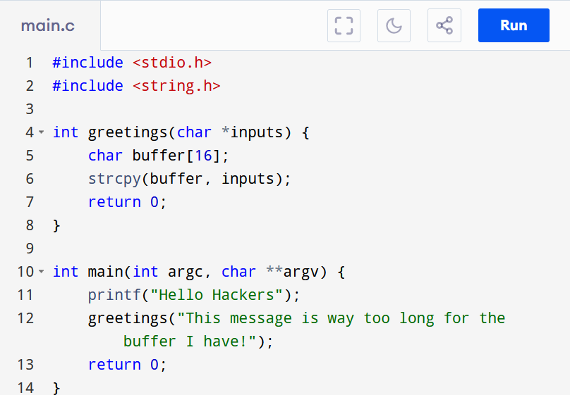

Still textbook, but this time the bug is contained in a second function called greetings which takes an input from main that is way bigger than what it can hold.

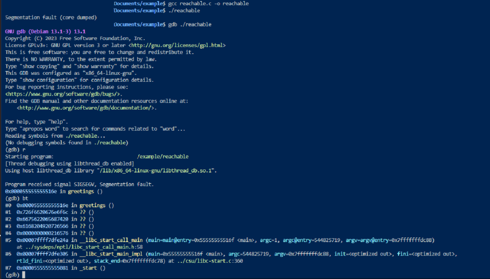

The program is behaving like we expected, crashing in greetings when trying to process an input way bigger than the buffer can hold.

Let's see a third example

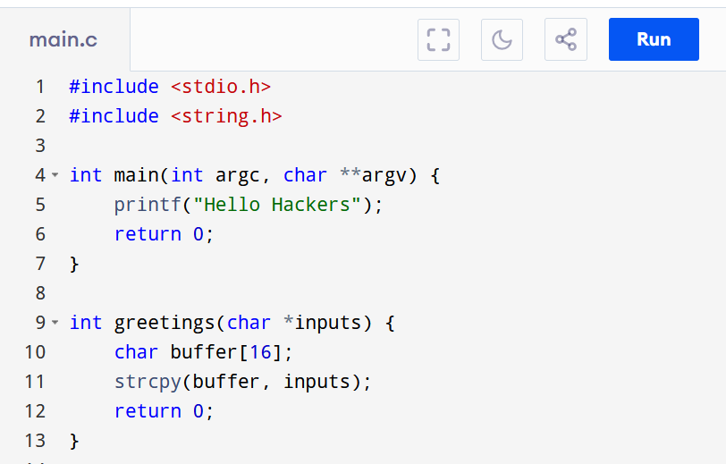

This code contains a bug indeed, the greetings function is copying inputs without any bound into a buffer[16] which will very rapidly overflow HOWEVER, this part of the code is NEVER reached. Yes the bug is present, yes it's a vulnerability BUT it doesn't pose any immediate threat (solid exploit primitive tho) at the moment. Let's try to catch those bugs with SemGrep !

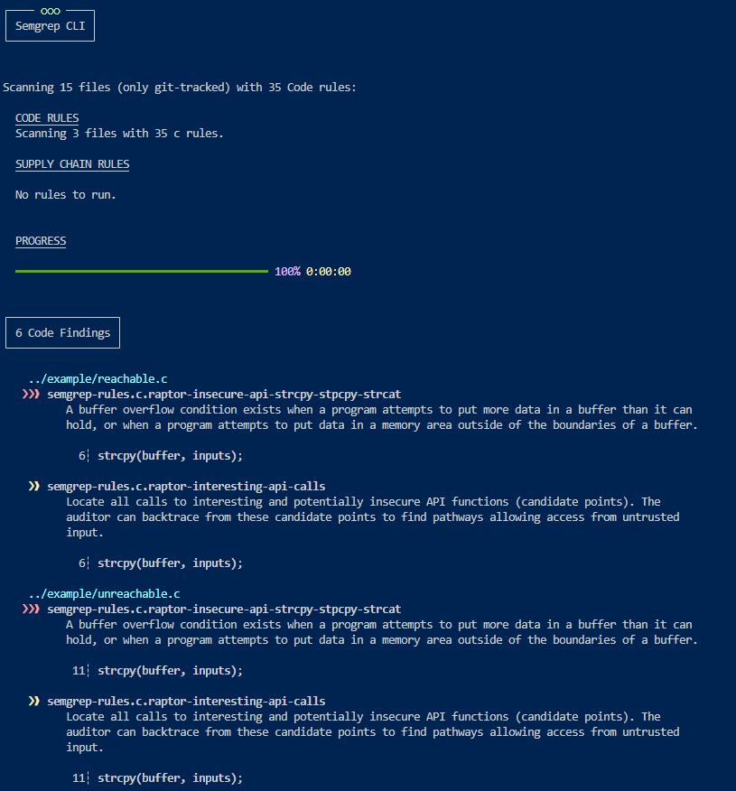

The issue with SemGrep is that as you can see if we run it against those two examples, it will flag both with the same level of importance, but as a good bug hunter what you want is bugs you can immediately leverage so you can hopefully claim a bounty for it!

This is where LLVM enter in action, it allows us to generate .ll or .bc file which can then be leverage into `Callgraph` and `Control Flow Graph`

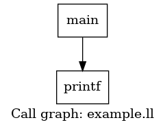
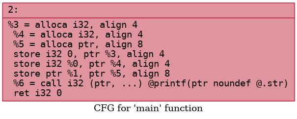

Here is what the callgraph and control flow graph of our example looks like. A call graph shows function-to-function calls across a program, while a control flow graph shows the execution flow between basic blocks within a single function. One is interprocedural, the other intraprocedural.

If we analyze our vulnerable examples before in their callgraph form we can clearly see the differences by emitting a visual representation of them with Graphviz.

- Unreachable:

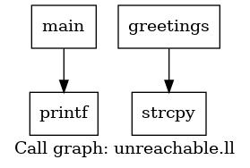

- Reachable:

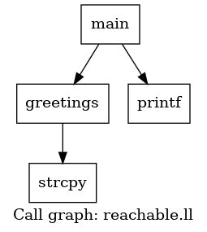

Ok, call graph are done! But in real life projects, control-flow graphs can become gigantesque !

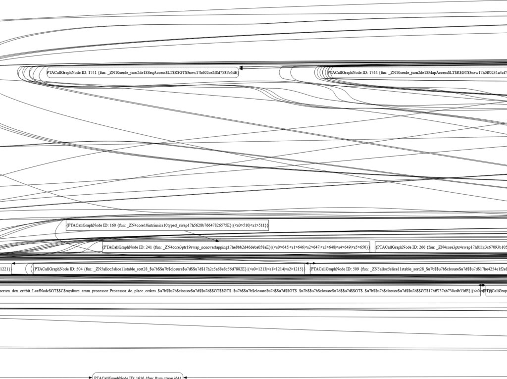

Feeding that to an LLM would definitely make it buggy, we circumvent this issue by slicing those cfg into smaller files based on SemGrep findings.

We’re slicing them around the exact line SemGrep flagged. In practice:

- Nodes = basic blocks or individual lines of code.
- Edges = the “flow” between those blocks (who can call whom or which block runs next). 

When we “slice” we start at the node for your vulnerable line, then grab every node and edge that’s within N hops (here N = 3) in or out of it. The result is a tiny sub-graph showing just the code paths leading into and out of that one spot, nothing else in the program.

## Improving LLMs

As we saw in the beginning of this article, feeding a document to an LLM greatly improves the answer it provides (even tho it doesn't change the furniture building instructions you didn't respect).

However, in security we often deal with dozens of files. That's where RAG comes into action: Retrieval-Augmented Generation. Think of it like this: Instead of feeding a gigantic amount of documents in a single context, which not only is limited but also tend to confuse the model, you give it access to a library of documents it can retrieve in real-time to improve its answer!

This allows us to provide a multitude of valuable information to our LLM, source files, SemGrep results, callgraph and control-flow-graph, template, etc.

#### What if I can't share the source code I'm auditing 

This is where LLaMA comes to the rescue !
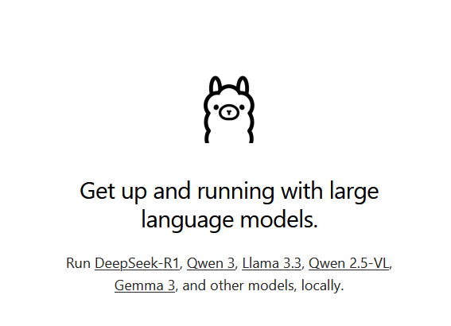

Ollama is a tool for running and managing large language models (LLMs) locally on your machine. It simplifies downloading, serving, and interacting with models like LLaMA or Mistral via a simple CLI or API.

What about the files you'll tell me ? Here comes ChromaDB.

It's simple, user friendly, plug and play with ollama, and it allows you to transform your local LLM into a RAG!

# Introducing: Golem

Golem is a tool I wrote that leverages all these components we discussed: LLM, SemGrep, LLVM, to produce an automated bug hunting tool for my fellow hackers. It flags potential security issues, generates rich graph artifacts, and leverages large-language models to produce a detailed, prioritized audit report, so you can find and fix critical bugs faster.

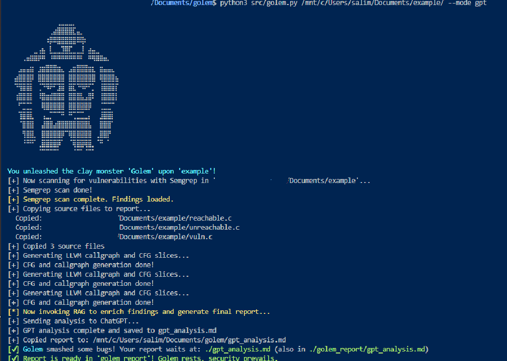

How does Golem work? Basically you have to compile your project with LLVM to emit `.ll` files, Golem will then proceed to analyze the entire project directory with SemGrep. It will then gather all the interesting files based on SemGrep finding and collect their source codes, LLVM callgraph/cfg, and feed it to a RAG. The RAG will then analyze those files and emit a report on the validity or invalidity of the findings.

Golem supports local Ollama models and ChatGPT, it allows you to select the model of your choice and you can add the SemGrep rules of your choices too!

Enough talk, let's run it against our examples!

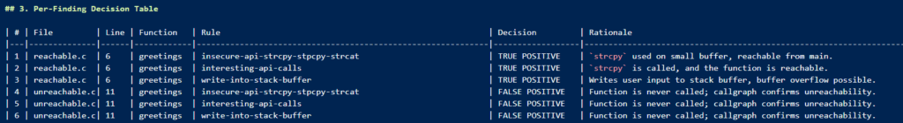

As we can see it correctly identified the valid bug from the invalid ones!  More importantly it gives us a complete rationale on why it classified a bug as valid or invalid:

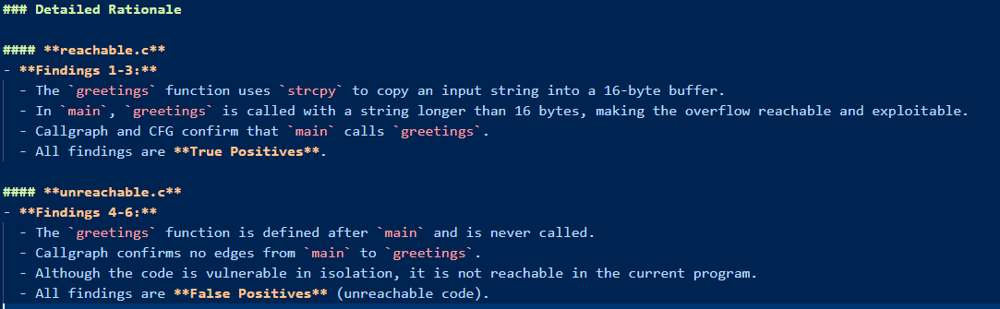

Golem produces a nice report with your valid/invalid findings, an executive summary and a conclusion. For debugging purposes it list all the files it received during the audit:

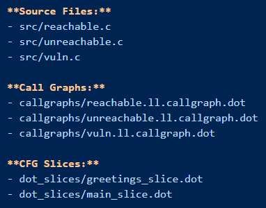

You can find Golem at: https://github.com/20urc3/golem 

**Happy hunting!**

### References
- https://astexplorer.net/
- https://arxiv.org/abs/2506.00054
- https://www.trychroma.com/
- https://github.com/semgrep/semgrep
- https://ollama.com/
- https://godbolt.org/
- https://mcyoung.xyz/2023/08/01/llvm-ir/