## Introduction

In this chapter we’ll dive into **grey-box fuzzing** on **closed-source Windows binaries** (PE executables) using **WinAFL**.

The appeal is simple: Windows grey-box fuzzing has more friction (tooling, reversing, patching, debugging), so fewer people do it seriously — which means the targets are often less explored and the odds of finding interesting bugs can be higher.

By the end of this tutorial you will be able to:

- run WinAFL with DynamoRIO on a Windows PE target,
- patch “GUI blockers” that prevent automation,
- compute a correct `target_offset`,
- launch a fuzzing campaign and triage a crash.

### What you’ll need to overcome

To fuzz a closed-source Windows binary effectively, you usually must:

- **Instrument execution** (to get coverage feedback),
- **Pick a good target function** (one that parses your input),
- **Patch or adapt the binary** (remove slow/interactive behavior like GUI prompts).

There are multiple fuzzing solutions for Windows, but we’ll focus on **WinAFL**.

WinAFL supports three instrumentation modes:

- **Dynamic instrumentation via DynamoRIO** — instruments the program while it runs.
- **Static instrumentation via Syzygy** — instruments at build/rewriting time.
- **Hardware tracing via Intel Processor Trace (Intel PT)** — records control flow using CPU tracing.

In this chapter we’ll use **dynamic instrumentation with DynamoRIO**, because it’s the easiest to apply to closed-source binaries without rebuilding them.

Here is the high-level workflow of **WinAFL + DynamoRIO** during fuzzing:

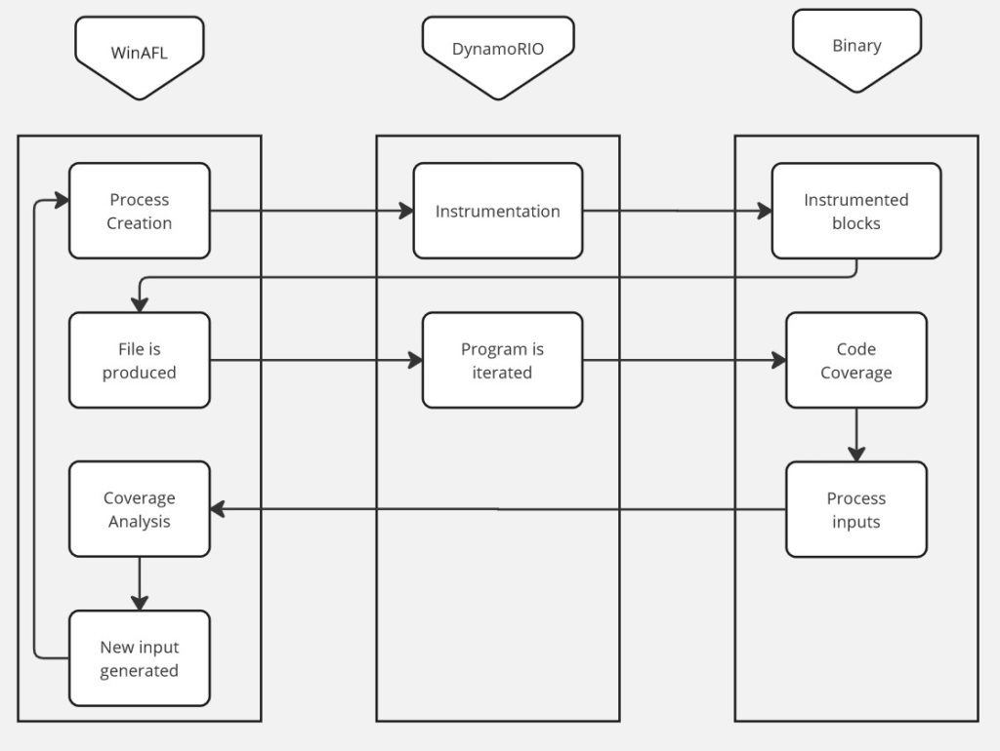

---

## Glossary (quick)

- **VA** (Virtual Address): the address you see in disassembly (ex: `0x00401060`).
- **Image base**: the preferred load base of the PE module (ex: `0x00400000`).
- **RVA / offset**: relative address from module base (`VA - ImageBase`).
- **XREF**: cross-reference (a place where something is referenced/called).
- **target_offset**: the function offset WinAFL hooks, relative to module base.

---

## Before you start (recommended lab setup)

Fuzzing is chaotic by design. Keep it safe and stable:

- Use a **Windows VM** (Snapshot it before starting).
- Put the target binary, corpus, and output directory on a **fast disk** (SSD).
- Prefer a dedicated folder like:
  - `C:\fuzz\winafl\`
  - `C:\fuzz\target\`
  - `C:\fuzz\cases\`
  - `C:\fuzz\out\`

### Security note (AV / Defender)

Fuzzing generates many weird files quickly and can slow down dramatically if your AV scans everything.

**Safe approach:**
- keep the VM isolated,
- add **exclusions only** for the fuzzing folders (`in`, `out`, temp working dir),
- avoid disabling protections globally unless you truly understand the impact.

---

## Compiling WinAFL

1. If you are building with DynamoRIO support, download and build DynamoRIO sources or download DynamoRIO Windows binary package from [https://github.com/DynamoRIO/dynamorio/releases](https://github.com/DynamoRIO/dynamorio/releases)  
2. If you are building with Intel PT support, pull third party dependencies by running **`git submodule update --init --recursiv`**`e` from the WinAFL source directory  
3. Open Visual Studio Command Prompt (or Visual Studio x64 Win64 Command Prompt if you want a 64-bit build). Note that you need a 64-bit winafl.dll build if you are fuzzing 64-bit targets and vice versa.  
4. Go to the directory containing the source  
5. Type the following commands. Modify the `-DDynamoRIO_DIR` flag to point to the location of your DynamoRIO cmake files (either full path or relative to the source directory).

**For a 32-bit build:**
```bash
$ mkdir build32  
$ cd build32  
$ cmake -G"Visual Studio 16 2019" -A Win32 .. -DDynamoRIO_DIR=..pathtoDynamoRIOcmake -DINTELPT=1  
$ cmake --build . --config Release
````

**For a 64-bit build:**

```bash
$ mkdir build64  
$ cd build64  
$ cmake -G"Visual Studio 16 2019" -A x64 .. -DDynamoRIO_DIR=..pathtoDynamoRIOcmake -DINTELPT=1  
$ cmake --build . --config Release
```

### Build configuration options

The following cmake configuration options are supported:

* **`-DDynamoRIO_DIR=..pathtoDynamoRIOcmake`** — Needed to build the winafl.dll DynamoRIO client
* **`-DINTELPT=1`** — Enable Intel PT mode. For more information see [https://github.com/googleprojectzero/winafl/blob/master/readme_pt.md](https://github.com/googleprojectzero/winafl/blob/master/readme_pt.md)
* **`-DUSE_COLOR=1`** — color support (Windows 10 Anniversary edition or higher)
* **`-DUSE_DRSYMS=1`** — Drsyms support (use symbols when available to obtain -target_offset from -target_method). Enabling this has been known to cause issues on Windows 10 v1809, though there are workarounds, see [#145](https://github.com/googleprojectzero/winafl/issues/145)

---

## Find a target

Finding the right target to fuzz is part art, part practicality.

A good fuzzing target is often:

* complex enough to have bugs (parsers, file formats, protocols),
* reachable and deterministic enough to fuzz efficiently,
* and ideally not already fuzzed to death.

One strategy is to look at vendors that have a history of published vulnerabilities and strong disclosure programs. A good starting point is the [Zero Day Initiative](https://www.zerodayinitiative.com/).

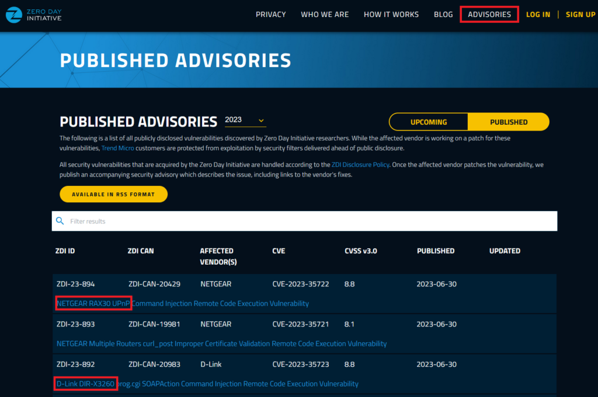

You’ll find previously disclosed bugs, which gives you an idea of products that are being attacked and fixed in the real world.

For this tutorial, we’ll use a purpose-built target: a vulnerable file reader created specifically to make this chapter fun and hands-on. It takes a file as input, copies its content into a buffer, and closes the file.

Download: password **"bushido"**
[https://drive.google.com/file/d/1c-cOuzYbC-gOFW91a2EHKNpZTiPrVdBP/view?usp=sharing](https://drive.google.com/file/d/1c-cOuzYbC-gOFW91a2EHKNpZTiPrVdBP/view?usp=sharing)

---

## Patching binary to allow fuzzing

A lot of Windows applications rely on interactive flows:

* confirmation dialogs,
* popups,
* UI prompts,
* “Press OK to continue” blockers.


This makes fuzzing impossible because the fuzzer cannot click buttons.

So let’s patch the target binary to remove the dialog and make it fuzzable.

### Open the binary in Ghidra

Download and install **Ghidra**, create a project, and import `vulnerable_reader.exe`.

Click **Options..** and enable **Load Local Libraries From Disk**.

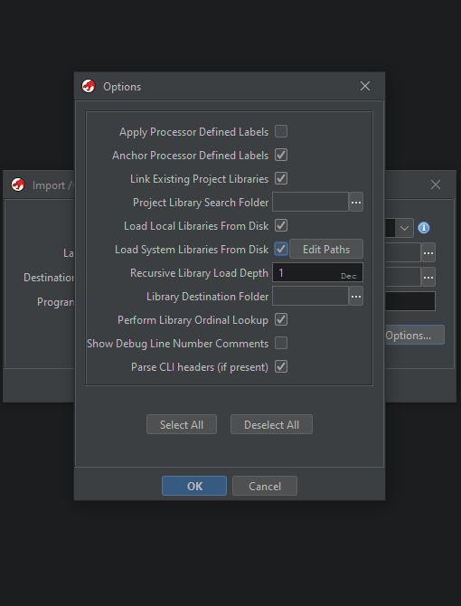

Double click the binary in the project, accept the analysis dialog.

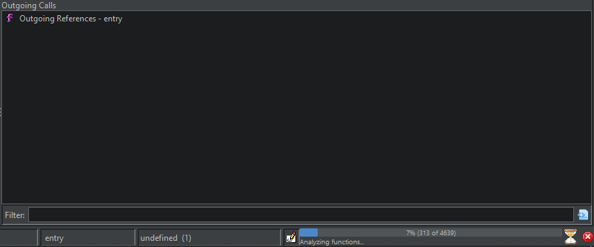

Tip: save the analyzed project once analysis is finished. For real-world binaries, analysis time can become significant.

---

## Locate and remove the GUI blocker

We already know one dialog string: **"You clicked Yes!"**.

Go to: `Search > Program text` and enter `You clicked Yes!`.
Enable **all fields** and **all blocks**, then click **Search All** and double click the first result.

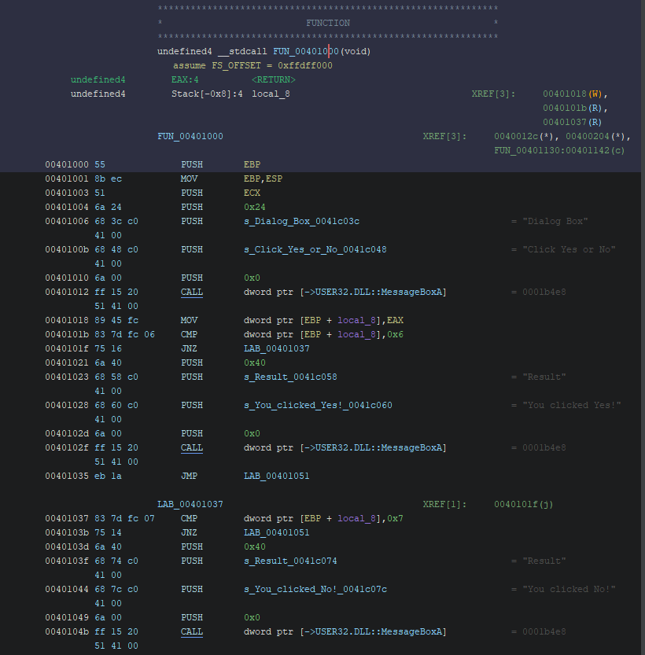

You’ll find that the dialog code blocks execution until the user clicks something.

Now look at the **XREFs** (cross-references): these show where `FUN_00401000` is called.

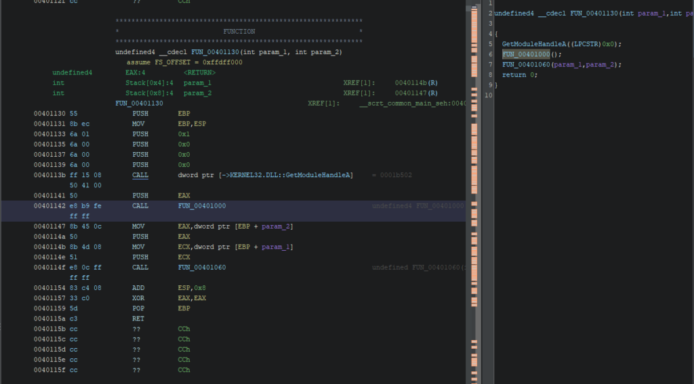

Here the call originates from `FUN_00401130`, which looks like the main execution flow.

### Patch the CALL into NOPs

Replace:

* `CALL FUN_00401000`

with:

* a sequence of `NOP` instructions.

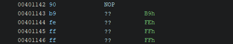

After patching, you’ll see `??` bytes.

This is not about “alignment” — it’s about **instruction size**:

* the original `CALL` instruction uses multiple bytes,
* a `NOP` is typically one byte (`0x90`),
* so you must pad the remaining bytes with NOPs to keep instruction boundaries valid.

The final output should look like this:

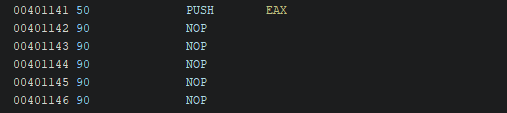

### Export the patched binary

Export as PE:

`File > Export Program`, select `Original File`, and choose the destination path.

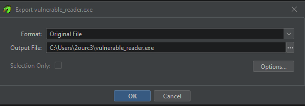

Now run the binary again: the dialog should be gone.

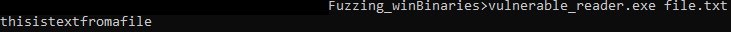

Nice. This is a simple case, but the core lesson generalizes well:

**GUI == fuzzing poison.**
If you’re serious about Windows fuzzing, basic reversing is unavoidable.

---

## Function offset and why WinAFL needs it

WinAFL is built to fuzz inner parsing logic efficiently instead of restarting the entire program from scratch for every test case.

The key idea is: run the target until a specific function, then execute that function repeatedly with new inputs in a tight loop (so you avoid a lot of expensive setup work each iteration).

A simplified diagram:

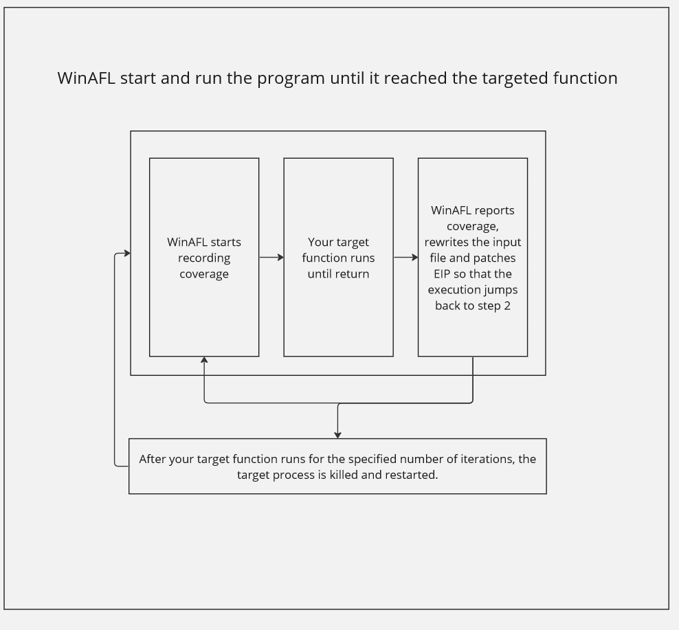

### How to select a target function

Your target function should ideally:

1. **Open the input file** (inside the target function)
2. **Parse it** (so coverage reflects parsing behavior)
3. **Close the input file** (otherwise WinAFL can’t rewrite it between iterations)
4. **Return normally** (WinAFL relies on “clean returns” — if the function exits the process, persistent fuzzing breaks)

---

## How to find the offset of the function

Options include:

* Static analysis with [Ghidra](https://github.com/NationalSecurityAgency/ghidra) or [radare2](https://rada.re/)
* Debugging with [WinDBG](https://learn.microsoft.com/en-us/windows-hardware/drivers/debugger/debugger-download-tools) or [x64dbg](https://x64dbg.com/#start)
* Instrumentation/monitoring tools like [ProcMon](https://learn.microsoft.com/en-us/sysinternals/downloads/procmon)

We’ll do it with **Ghidra** (fast and clean).

---

## Find offset via static analysis with Ghidra

The binary contains error messages like **"Failed to open file"**.

Go to `Search > Program Text` and search that string:

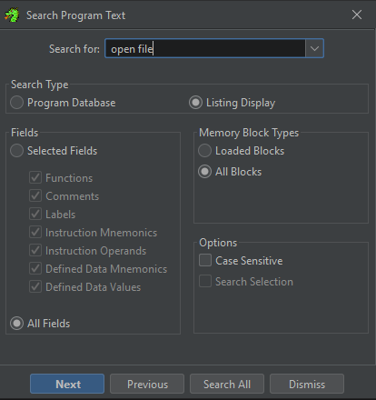

Click **Search All** and inspect results:

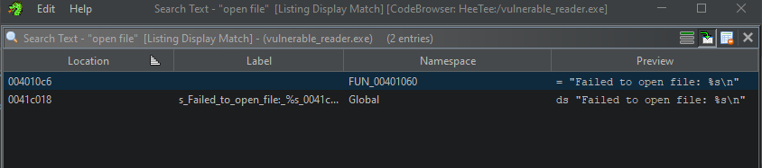

Double click the first occurrence inside `FUN_00401060`:

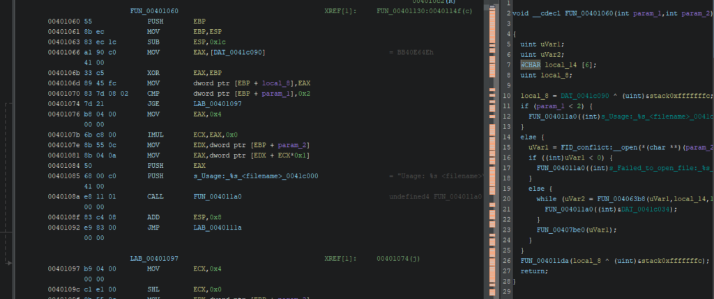

Now verify that the function matches our expected fuzzing flow:

* opens file,
* reads/parses,
* closes,
* returns normally.

The decompiled pseudo-code matches that pattern (simplified):

```c
void __cdecl FUN_00401060(int argc, int argv)  
 {  
   uint openResult;  
   uint readResult;  
   WCHAR fileContentBuffer[6]; // Buffer to store file content  
   uint localVariable;  
   
   localVariable = DAT_0041c040 ^ (uint)&stack0xfffffffc;  
   
   if (argc < 2) {  
     FUN_00401130((int)s_Usage:_%s_<filename>_0041c000); // Print usage message  
   }  
   else {  
     openResult = FID_conflict:__open(*(char **)(argv + 4), 0x8000); // Open file specified in argv[1]  
     
     if ((int)openResult < 0) {  
       FUN_00401130((int)s_Failed_to_open_file:_%s_0041c018); // Print error message if file opening fails  
     }  
     else {  
       while (readResult = FUN_00406348(openResult, fileContentBuffer, 10), 0 < (int)readResult) {  
         FUN_00401130((int)&DAT_0041c034); // Print file contents  
       }  
       FUN_00407b70(openResult); // Close the file  
     }  
   }  
   FUN_0040116a(localVariable ^ (uint)&stack0xfffffffc); // Some additional function call  
   return;  
  }
```

### Compute `target_offset`

In Ghidra, the function address is:

* VA = `0x00401060`

The module base is:

* ImageBase = `0x00400000`

So:

* `target_offset = VA - ImageBase`
* `target_offset = 0x00401060 - 0x00400000 = 0x00001060`

So our offset is:

* `0x01060`

**Ghidra CheatSheet**: [https://ghidra-sre.org/CheatSheet.html](https://ghidra-sre.org/CheatSheet.html)

---

## Prepare environment for fuzzing

Fuzzing is resource-heavy and noisy. A few practical tweaks help:

* Disable automatic debugging popups (they stall fuzzing)
* Avoid slow I/O locations (cloud folders, network drives)
* Prefer exclusions rather than global AV disabling (see earlier note)

---

## Optimization (corpus minimization)

Input corpora matter. A good corpus makes fuzzing faster and deeper.

WinAFL provides `winafl-cmin.py` to minimize your corpus while keeping coverage.

Examples:

* **Typical use**

```powershell
  winafl-cmin.py -D D:DRIObin32 -t 100000 -i in -o minset -covtype edge -coverage_module m.dll -target_module test.exe -target_method fuzz -nargs 2 -- test.exe @@  
```

* **Dry-run, keep crashes only with 4 workers with a working directory:**

```powershell
  winafl-cmin.py -C --dry-run -w 4 --working-dir D:dir -D D:DRIObin32 -t 10000 -i in -i C:fuzzin -o out_mini -covtype edge -coverage_module m.dll -target_module test.exe -target_method fuzz -nargs 2 -- test.exe @@ 
```

* **Read from specific file**

```powershell
  winafl-cmin.py -D D:DRIObin32 -t 100000 -i in -o minset -f foo.ext -covtype edge -coverage_module m.dll -target_module test.exe -target_method fuzz -nargs 2 -- test.exe @@ 
```

* **Read from specific file with pattern**

```powershell
  winafl-cmin.py -D D:DRIObin32 -t 100000 -i in -o minset -f prefix-@@-foo.ext -covtype edge -coverage_module m.dll -target_module test.exe -target_method fuzz -nargs 2 -- test.exe @@ 
```

* **Typical use with static instrumentation**

```powershell
  winafl-cmin.py -Y -t 100000 -i in -o minset -- test.exe @@
```

`winafl-cmin.py` can take a while, especially with larger corpora.

---

## Running a campaign

Now we have:

* a patched binary (no GUI blockers),
* a target parsing function,
* the correct `target_offset`.

Let’s fuzz.

WinAFL parameters you’ll commonly use:

* **`-t`** — Timeout per iteration
* **`-D`** — DynamoRIO path
* **`-coverage_module`** — which module’s coverage you measure
* **`-target_module`** — module containing the function you hook
* **`-target_offset`** — function offset from module base
* **`-fuzz_iterations`** — how many iterations before restarting process
* **`-call_convention`** — calling convention: `stdcall`, `cdecl`, `thiscall`
* **`-nargs`** — number of arguments to the target function

### Important: coverage_module pitfalls

If you select the wrong `-coverage_module`, you may see:

* flat coverage (no new edges),
* extremely low exec/s,
* no progress despite lots of mutations.

**Rule of thumb**: coverage should be measured in the module that contains the parsing logic.
In our case, both are `vulnerable_reader.exe`.

### How to determine calling convention / nargs (quick reasoning)

In real targets, this matters a lot.

How to infer it:

* If the function is a normal C-like function and decompiler shows `__cdecl`, prefer `cdecl`.
* If it’s a member-method / C++ style, you often see `thiscall`.
* The number of arguments can be derived from:

  * decompiler signature,
  * stack usage around the call site,
  * runtime debugging (breakpoints + register/stack inspection).

In our toy target, we follow the expected function signature used by the binary’s call pattern.

---

### Launch WinAFL

**WARNING**: We built two WinAFL versions (32-bit / 64-bit).
Make sure you use the correct one for your target binary.

Create an `in` folder with at least one tiny seed file. Example: a text file containing a short sentence.

Then run:

```powershell
afl-fuzz.exe -i in -o out -t 10000 -D C:WinAFLDynamoRIObin32 -- -fuzz_iterations 500 -coverage_module vulnerable_reader.exe -target_module vulnerable_reader.exe -target_offset 0x01060 -nargs 3 -call_convention thiscall -- vulnerable_reader.exe @@
```

If everything is correct, you should see WinAFL running:

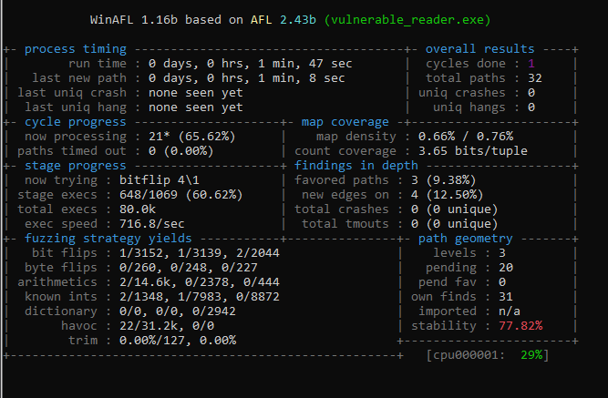

Let it run a bit. With this tutorial target, a crash should happen quickly:

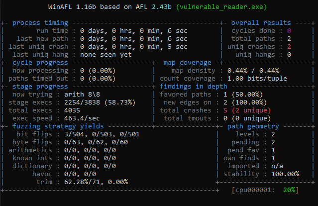

---

## Analyze crash test

WinAFL stores crashing inputs in:

* `out\crashes\`

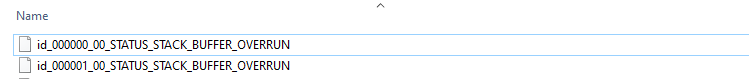

This binary was designed to crash easily, so you should see a classic **stack buffer overflow** style failure.

### Reproduce in WinDBG

Start WinDBG:

* `File > Launch Executable (advanced)`
* Executable: the vulnerable binary
* Arguments: the crash file path (or use it as input depending on how your binary consumes it)

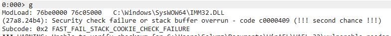

WinDBG will complain about a stack buffer overrun.

### Minimal triage checklist (what you should do next)

For real-world targets, don’t stop at “it crashes”. You want to validate the crash class and how controllable it is:

* Run:

  * `!analyze -v`
* Inspect call stack:

  * `k` / `kv`
* Inspect registers:

  * `r`
* Inspect the faulting instruction and surrounding code:

  * `u @eip` / `u @rip`
* Confirm whether it’s:

  * an access violation,
  * a stack cookie failure,
  * an OOB write,
  * or a controlled overwrite.

Even when exploitability is blocked (stack cookies/CFG/etc.), bugs like this are still valuable as vulnerability reports.

---

## Recap (what you learned)

You now know how to:

* patch a Windows binary to remove interactive UI blockers,
* locate a parsing function in Ghidra using strings + XREFs,
* compute a correct WinAFL `target_offset` from VA and image base,
* run WinAFL with DynamoRIO in persistent fuzzing mode,
* collect and reproduce crashes in WinDBG.

---

## References

* **WinAFL** — [https://github.com/googleprojectzero/winafl](https://github.com/googleprojectzero/winafl)
* **DynamoRIO** — [https://dynamorio.org/](https://dynamorio.org/)
* **Syzygy** — [https://github.com/google/syzygy/wiki](https://github.com/google/syzygy/wiki)
* **Intel PTrace** — [https://edc.intel.com/content/www/us/en/design/ipla/software-development-platforms/client/platforms/alder-lake-desktop/12th-generation-intel-core-processors-datasheet-volume-1-of-2/004/intel-processor-trace/](https://edc.intel.com/content/www/us/en/design/ipla/software-development-platforms/client/platforms/alder-lake-desktop/12th-generation-intel-core-processors-datasheet-volume-1-of-2/004/intel-processor-trace/)
* **ProcMon** — [learn.microsoft.com/en-us/sysinternals/downloads/procmon](https://learn.microsoft.com/en-us/sysinternals/downloads/procmon)
* **x64dbg** — [x64dbg.com/#start](https://x64dbg.com/#start)
* **WinDBG** — [https://learn.microsoft.com/en-us/windows-hardware/drivers/debugger/debugger-download-tools](https://learn.microsoft.com/en-us/windows-hardware/drivers/debugger/debugger-download-tools)
* **Ghidra CheatSheet** — [https://ghidra-sre.org/CheatSheet.html](https://ghidra-sre.org/CheatSheet.html)
* **Windows Internals** — [scorpiosoftware.net/category/windows-internals/](https://scorpiosoftware.net/category/windows-internals/)
